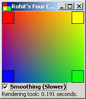



## Four Colour Gradient \- One colour on each corner \- New Version

### Description

New Version! FOr those of you who did not see the previous project, this is a module that draws four colour gradients, one colour each corner of the rectangle. Thanks for voting for the previous release. Since RGB values range from 0 to 255, the changes of RGB values should fit in a square of dimensions 255 x 255. Hence using this theory, I have made a module that draws gradients super fast irrespective of it's size. Also, I have included optional halftoning of colours to get smoothest gradients irrespective of the screen resolutions (lower resolutions otherwise would cause 'banding'). Please vote. Thanks again.
 
### More Info
 

             |
---                |---
**Submitted On**   |2002-08-02 08:41:14
**By**             |[Sunero Technologies](https://github.com/Planet-Source-Code/PSCIndex/blob/master/ByAuthor/sunero-technologies.md)
**Level**          |Advanced
**User Rating**    |5.0 (45 globes from 9 users)
**Compatibility**  |VB 5\.0, VB 6\.0
**Category**       |[Graphics](https://github.com/Planet-Source-Code/PSCIndex/blob/master/ByCategory/graphics__1-46.md)
**World**          |[Visual Basic](https://github.com/Planet-Source-Code/PSCIndex/blob/master/ByWorld/visual-basic.md)
**Archive File**   |[Four\_Colou923436102002\.zip](https://github.com/Planet-Source-Code/sunero-technologies-four-colour-gradient-one-colour-on-each-corner-new-version__1-35669/archive/master.zip)

